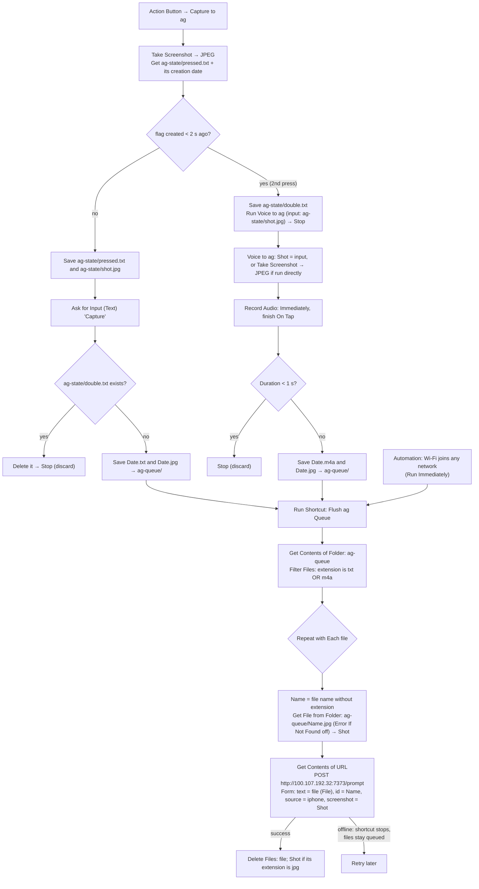

# iOS Shortcut: Capture / Voice to ag (Action Button, screenshot, offline queue)

The iPhone Action Button runs **Capture to ag**:
- **One press (press and hold once)**: grabs a screenshot of whatever is on screen and opens the
  "Capture" text box. Type, tap Done.
- **Double press (a second press within 2 seconds)**: hands off to **Voice to ag**, which starts
  recording right away (with the screenshot from the first press). Tap the screen to finish; the
  recording is sent to ag, transcribed with Whisper (TrueFoundry), and the transcript becomes the prompt.

Either way the capture becomes a new pi session in the **Inbox** workspace via the ag inbox
(`ag-inbox`, port 7373, Tailscale only). This is the GTD inbox capture point.

How the double press works: iOS has no native double press, and a shortcut can't detect a release,
so each press is a separate run of Capture to ag. Before opening the text box, a run saves
`ag-state/pressed.txt` and the screenshot as `ag-state/shot.jpg`. A run that finds `pressed.txt`
created in the last 2 seconds is the second press: it saves `ag-state/double.txt` and runs Voice to
ag with `shot.jpg` as input. The first press's text box may still be up underneath: if you tap Done
on it later, it sees `double.txt` and discards itself; Cancel works too. A stale flag (older than 2 s)
is ignored, so it never needs cleaning up. A recording shorter than 1 second is discarded.

iPhone Mirroring can't use the phone's microphone or press the Action Button, so voice capture
and real button presses can only be tested on the physical phone.

The screenshot is only handed to the agent when it's needed: Jev judges from the prompt
(transcript) whether it refers to what was on screen ("what song is this?" → attached; "remind me to
call mom Sunday" → not). The screenshot is always saved in `ag-mac:~/inbox/capture/` either way, and so
is the recording. Same gate as the Mac quick capture. If Jev judges the capture to be new context for a session that's already open, it's added to that session instead of opening a new one; see the README's "ag inbox" section.

Every capture is first saved to a queue folder on the phone (prompt as `<stamp>.txt` or
recording as `<stamp>.m4a`, screenshot as `<stamp>.jpg`, all in `ag-queue/`), then the queue is
flushed. If ag-mac is unreachable (bad signal, Tailscale down), the items stay queued and are sent on
the next capture or when the phone joins Wi-Fi. No success notification is shown. The server
ignores a repeated `id`, so resending an item whose response was lost is safe.

The flush sends every queued file as the form field `text` with type **File**: ag-inbox reads a
`.txt` as the prompt and treats an audio file (`.m4a`/`.caf`/`.wav`/…) as a voice recording.

## Build steps

1. In Files, create the folders **iCloud Drive › Shortcuts › ag-queue** and **Shortcuts › ag-state**.
   (The older `ag-queue/shots` folder is no longer used.)
2. Shortcut **Flush ag Queue**:
   1. **Get Contents of Folder**: ag-queue (Recursive off).
   2. **Filter Files**: Folder Contents where **Any** of: **File Extension** is `txt`; **File Extension** is `m4a`.
   3. **Repeat with Each** item in Files:
      - **Get Details of Files**: **Name** of Repeat Item (variable *Name*).
      - **Get File from Folder**: Shortcuts folder, path `ag-queue/[Name].jpg`,
        **Error If Not Found** off (variable *Shot*).
      - **Get Contents of URL**: `http://100.107.192.32:7373/prompt`; Method **POST**,
        Request Body **Form**; `text` (**File**) = **Repeat Item**; `id` (Text) = *Name*;
        `source` (Text) = `iphone`; `screenshot` (File) = *Shot*.
      - **Delete Files**: Repeat Item; **Delete Immediately** off (files go to Recently Deleted;
        this iOS version shows no confirmation toggle).
      - **If** *Shot* › **File Extension** is `jpg` → **Delete Files**: *Shot* (Delete Immediately off).
        **End If**. (Testing the extension, not "has any value", so a failed lookup can never delete a folder.)
3. Shortcut **Capture to ag** (Action Button):
   1. **Take Screenshot** (Full Screen) → **Convert Image**: JPEG.
   2. **Get File from Folder**: Shortcuts, `ag-state/pressed.txt`, Error If Not Found off →
      **Get Details of Files**: Date Created.
   3. **If** (All) File has any value **and** Date Created is in the last 2 seconds →
      **Get File from Folder** `ag-state/shot.jpg` (Error If Not Found off) → **Text** `1` →
      **Set Name** `double.txt` → **Save File**: subpath `ag-state/` (Ask off, Overwrite on) →
      **Run Shortcut**: Voice to ag, input = the shot.jpg File → **Stop This Shortcut** → **End If**.
   4. **Text** `1` → **Set Name** `pressed.txt` → **Save File**: subpath `ag-state/`, Ask off,
      Overwrite on. (A Text item always gets a `.txt` name, so flags live outside `ag-queue` or the
      flush would send them.)
   5. **Set Name**: Converted Image → `shot.jpg` → **Save File**: subpath `ag-state/`, Ask off, Overwrite on.
   6. **Ask for Input**: Text, prompt "Capture", multiple lines.
   7. **Get File from Folder**: `ag-state/double.txt` (Error If Not Found off) → **If** has any value
      → **Delete Files** → **Stop This Shortcut** → **End If**.
   8. **Format Date**: Current Date, Custom `yyyyMMdd-HHmmss-SSS`.
   9. **Set Name**: Provided Input → `<Formatted Date>.txt` → **Save File**: subpath `ag-queue/`, Ask off, Overwrite on.
   10. **Set Name**: Converted Image → `<Formatted Date>.jpg` → **Save File**: subpath `ag-queue/`, Ask off, Overwrite on.
   11. **Run Shortcut**: Flush ag Queue. No Show Notification action.
4. Shortcut **Voice to ag** (double press; accepts Images and Files as input):
   1. **If** Shortcut Input has any value → **Set Variable** *Shot* = Shortcut Input; **Otherwise** →
      **Take Screenshot** → **Convert Image** JPEG → **Set Variable** *Shot* = Converted Image. **End If**.
   2. **Record Audio**: Quality Normal, Start Recording **Immediately**, Finish Recording **On Tap**.
   3. **Get Details of Media**: Duration of Recorded Audio → **If** less than 1 → **Stop This Shortcut** → **End If**.
   4. **Format Date**: Current Date, Custom `yyyyMMdd-HHmmss-SSS`.
   5. **Set Name**: Recorded Audio → `<Formatted Date>.m4a` → **Save File**: subpath `ag-queue/`, Ask off, Overwrite on.
   6. **Set Name**: *Shot* → `<Formatted Date>.jpg` → **Save File**: subpath `ag-queue/`, Ask off, Overwrite on.
   7. **Run Shortcut**: Flush ag Queue.
5. Automation → New → **Wi-Fi** → Any Network → **Is Joined** → **Run Immediately**
   → Run Shortcut **Flush ag Queue**.
6. First run: allow microphone, connecting to `100.107.192.32` → **Always Allow**, running
   other shortcuts → **Always Allow**; allow folder access and screenshots if asked.
7. Settings → **Action Button** → **Shortcut** → *Capture to ag*.

Offline, the flush step shows iOS's own "could not connect" error; the item is still
queued. Test without the phone:
`curl -X POST http://ag:7373/prompt --data-urlencode 'text=hello' -d id=test1` → redirect/`202`;
repeating it with the same `id` within 24 h logs `duplicate` and opens nothing.
Voice without opening anything:
`say -o /tmp/v.m4a --data-format=aac 'what song is this'; curl -F dry=1 -F text=@/tmp/v.m4a http://ag:7373/prompt`.
Screenshot gate without opening anything:
`curl -F dry=1 -F 'text=what song is this' -F screenshot=@shot.png -F source=iphone http://ag:7373/prompt | jq -r .prompt`.

## Status

Claude (anthropic-primary/claude-opus-5-5), assisting Nathan:

- 2026-09-27: Capture to ag built and verified (request `5e879379` landed in Inbox).
- 2026-09-27 (evening): Voice to ag added and set as the Action Button; Flush and Capture moved
  screenshots into `ag-queue/` after the `shots/` folder went missing (phone captures had been
  arriving without screenshots). Server side verified with synthetic recordings (transcript →
  prompt, screenshot gate, queued `.txt`/`.m4a` as `text` files). Still to verify on the physical
  phone: a real voice capture end to end, and whether a second Action Button press during a
  recording starts the typed capture.
- 2026-09-27 (night): voice capture verified end to end on the phone. Rebuilt Voice to ag for a fast
  single press (removed a 1 s wait and three iCloud file operations before recording) and a
  creation-date double-press check. Awaiting Nathan's physical single/double press test.
- 2026-09-30: swapped per Nathan: one press → typed Capture to ag (with screenshot), double press →
  Voice to ag. Both shortcuts rebuilt on the client Mac (verified in the editor). Still to do on the
  phone: set the Action Button to Capture to ag and test single/double press (Mirroring reported
  iPhone in Use).
